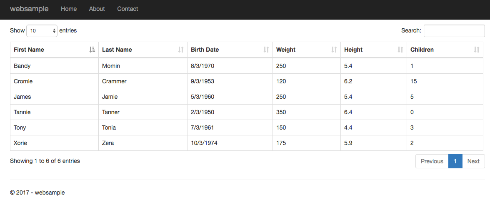

C# datatables parser
========================


A C# .Net Core Serverside parser for the popuplar [jQuery datatables plugin](http://www.datatables.net) 



Supported Platforms
==========================
The parser aims to be Database and Provider agnostic. It currently targets Netstandard 1.3. The solution includes tests for:
* Entity Framework Core
  * In Memory
  * MySql 
  * Sql Server
  * PostgreSQL

If you intend to filter your dataset, the default configuration assumes your IQueryable uses a provider with support for .ToString() on DateTime and numeric types. Please note that EFCore will not fail but instead fall back to client evaluation if this requirement is not met. I have mixed feelings about this. I believe client evaluation should be opt-in and not opt-out. 

jQuery Datatables
========================

The jQuery Datatables plugin is a very powerful javascript grid plugin which comes with the following features out of the box:

* Filtering
* Sorting
* Paging
* Themes
* Plugins  
* Ajax/Remote and local datasource support

Using the Parser
========================

Please see the [official datatables documentation](http://datatables.net/release-datatables/examples/data_sources/server_side.html) for examples on setting it up to connect to a serverside datasource.

The following snippets were taken from the aspnet-core-sample project also located in this repository

**HomeController.cs**
```c#
    public class HomeController : Controller
    {
        private readonly PersonContext _context;

        public HomeController(PersonContext context)
        {
            _context = context;
        }
        public IActionResult Index()
        {
            return View();
        }

        public IActionResult Data()
        {
            var parser = new Parser<Person>(Request.Form, _context.People);

            return Json(parser.Parse());
        }
    }
```
**Startup.cs**
```c#
        public IServiceProvider ConfigureServices(IServiceCollection services)
        {
        
            services.AddDbContext<PersonContext>(options => options.UseInMemoryDatabase("aspnet-core-websample"));

            services.AddMvc()
                    .AddJsonOptions(options =>
                    {
                        options.SerializerSettings.ContractResolver = new DefaultContractResolver();
                    });
                    
            return services.BuildServiceProvider();
        }
```
**Index.cshtml**
```html
        @{
            ViewData["title"] = "People Table";
        }

        <h2>Index</h2>
        <table class="table table-bordered " id="PeopleListTable"></table>

        @section Scripts
        {
            <script type="text/javascript">
                $(function () {
                    var peopleList = $('#PeopleListTable').DataTable({
                        serverSide: true,
                        processing: true,

                        ajax: {
                            url: '@Url.Action("Data", "Home")',
                            type: "POST"
                        },
                        rowId:'Id',
                        columns: [
                            { data: "FirstName", title: "First Name" },
                            { data: "LastName", title: "Last Name" },
                            { data: "BirthDateFormatted", title: "Birth Date", orderData: 3 }, //Allow post TSQL server side processing
                            { data: "BirthDate", visible: false },
                            { data: "Weight", title: "Weight" },
                            { data: "Height", title: "Height" },
                            { data: "Children", title: "Children" }

                        ]
                    });
                });
            </script>


        }
```
The included Dockerfile-websample builds, packages and runs the web sample project in a docker image. No tools, frameworks or runtimes are required on the host machine. The image has been published to docker for your convenience.  

    docker run -p 80:80 garvincasimir/datatables-aspnet-core-sample:0.0.2   

Projections
========================
I recommended always using a projection with the query that is sent to the parser. This strategy has 4 main benefits:
* Avoid inadverently serializing and sending sensitive fields to the client.
* Avoid custom non-database fields in your model
* Inlcude parent table fields
* Include computed fields

Below is an example of a self referencing table:

| EmployeeID  | FirstName | LastName | ManagerID | Token       | BirthDate |
| ----------- | --------- | -------- | --------  | ----------- | --------- |
| 1           | Mary      | Joe      | null      | s38fjsf8dj  | 3/3/1921  |
| 2           | Jane      | Jim      | 1         | 9fukfdflsl  | 2/2/1921  |
| 3           | Rose      | Jack     | 1         | s9fkf;;d;   | 1/1/1931  |


The model class:

```csharp
public class Employee
{
    public int EmployeeID {get;set;}
    public string FirstName {get;set;}
    public string LastName {get;set;}
    public int? ManagerID {get;set;}
    [ForeignKey("ManagerID")]
    public Employee Manager {get;set;}
    public string Token {get;set;}
    public DateTime BirthDate {get;set;}
}
```

Projection class:

```csharp
public class EmployeeResult
{
    public int EmployeeID {get;set;}
    public string FullName {get;set;}
    public int? ManagerID {get;set;}
    public string ManagerFullName {get;set;}
    public DateTime BirthDate {get;set;}
    public string BirthDateFormatted
    {
      get 
      {
          return String.Format("{0:M/d/yyyy}", BirthDate); 
      }
    }
}
```
Query:

```csharp
var query = from e in context.Employees
            let FullName = e.FirstName + " " + e.LastName
            let ManagerFullName = e.Manager.FirstName + " " + e.Manager.LastName
            select new EmployeeResult
            {
                EmployeeID = e.EmployeeID,
                FullName = FullName,
                ManagerID = e.ManagerID,
                ManagerFullName = ManagerFullName,
                BirthDate = e.BirthDate
            };
            
 var parser = new Parser<EmployeeResult>(Request.Form, query);
 
```


Custom Filter Expressions
========================
The parser builds a set of expressions based on the settings and filter text sent from Datatables. The end result is a *WHERE* clause which looks something like this:

```sql
FROM [People] AS [val]
WHERE ((((CASE
    WHEN CHARINDEX(N'cromie', LOWER([val].[FirstName])) > 0
    THEN CAST(1 AS BIT) ELSE CAST(0 AS BIT)
END | CASE
    WHEN CHARINDEX(N'cromie', LOWER([val].[LastName])) > 0
    THEN CAST(1 AS BIT) ELSE CAST(0 AS BIT)
END) | CASE
    WHEN CHARINDEX(N'cromie', LOWER(CONVERT(VARCHAR(100), [val].[BirthDate]))) > 0
    THEN CAST(1 AS BIT) ELSE CAST(0 AS BIT)
END) | CASE
    WHEN CHARINDEX(N'cromie', LOWER(CONVERT(VARCHAR(100), [val].[Weight]))) > 0
    THEN CAST(1 AS BIT) ELSE CAST(0 AS BIT)
END) | CASE
    WHEN CHARINDEX(N'cromie', LOWER(CONVERT(VARCHAR(11), [val].[Children]))) > 0
    THEN CAST(1 AS BIT) ELSE CAST(0 AS BIT)
END) = 1
```

In the above example, each of the case statements will attempt to find the filter text 'cromie' within a string representation of the properties from *T*. The exact mechanics and syntax will vary by provider and db engine but this is an example of the actual query sent to your backend database.

The expression generated by the parser looks like this:

```
 where val.FirstName.ToLower().Contains("cromie") || val.LastName.ToLower().Contains("cromie") || val.BirthDate.ToString().ToLower().Contains("cromie") || val.Weight.ToString().ToLower().Contains("cromie") || val.Children.ToString().ToLower().Contains("cromie")
```

What is missing in the above expression is the ability to format dates to match the client side. So it may seem strange to a user if they enter a date in the filter text box and no results are returned. It would be nice if providers just supported *DateTime.ToString(string format)* right? Even if they did, the format strings expected by db engines are not consistent at all. As a result, I decided to expose some of the internals of the parser and allow library users to substitute .ToString() with a custom expression.

For example, if your provider does support *DateTime.ToString(string format)*, you can substitute .ToString() with that expression after initializing the parser. This must be explicitly called for each applicable property.

```c#
var parser = new Parser<Person>(p, context.People)
                  .SetConverter(x => x.BirthDate, x => x.BirthDate.ToString("M/dd/yyyy"))
                  .SetConverter(x => x.LastUpdated, x => x.LastUpdated.ToString("M/dd/yyyy"));
```

**EF Core 2**

Thanks to [this](https://github.com/aspnet/EntityFrameworkCore/pull/8507) pull request by [Paul Middleton](https://github.com/pmiddleton), EF Core 2 supports mapping user defined and system scalar valued functions. These functions can be used for string conversions and custom formatting. The following is an example for SQL Server >= 2012. 

PersonContext.cs
```c#
    using Microsoft.EntityFrameworkCore;
    using System;

    namespace DataTablesParser.Tests
    {
        public class PersonContext : DbContext
        {
            public PersonContext(){ }

            public PersonContext(DbContextOptions<PersonContext> options)
            : base(options){ }

            //Sql Server >= 2012
            //https://docs.microsoft.com/en-us/sql/t-sql/functions/format-transact-sql
            [DbFunction(Schema="")]
            public static string Format(DateTime data,string format)
            {
                throw new Exception();
            }

            public DbSet<Person> People { get; set; }
        }
    }
   
```
Parser initialization

```c#

            var parser = new Parser<Person>(p, context.People)
                            .SetConverter(x => x.BirthDate, x => PersonContext.Format(x.BirthDate,"M/dd/yyyy"));
```

The *WHERE* clause now looks like this:

```sql
WHERE ((((CASE
    WHEN CHARINDEX(N'9/03/1953', LOWER([val].[FirstName])) > 0
    THEN CAST(1 AS BIT) ELSE CAST(0 AS BIT)
END | CASE
    WHEN CHARINDEX(N'9/03/1953', LOWER([val].[LastName])) > 0
    THEN CAST(1 AS BIT) ELSE CAST(0 AS BIT)
END) | CASE
    WHEN CHARINDEX(N'9/03/1953', LOWER(Format([val].[BirthDate], N'M/dd/yyyy'))) > 0
    THEN CAST(1 AS BIT) ELSE CAST(0 AS BIT)
END) | CASE
    WHEN CHARINDEX(N'9/03/1953', LOWER(CONVERT(VARCHAR(100), [val].[Weight]))) > 0
    THEN CAST(1 AS BIT) ELSE CAST(0 AS BIT)
END) | CASE
    WHEN CHARINDEX(N'9/03/1953', LOWER(CONVERT(VARCHAR(11), [val].[Children]))) > 0
    THEN CAST(1 AS BIT) ELSE CAST(0 AS BIT)
END) = 1
```

**EF Core 3+**

It isn't simple to call built-in functions in EF Core 3+. Use the same strategy from EF Core 2 but with a User Defined Function. Essentially, create a UDF and call the system function from there.

**EF6**

In EF6 you can make use of the [Sql Functions Class](https://msdn.microsoft.com/en-us/library/system.data.objects.sqlclient.sqlfunctions(v=vs.110).aspx) to format dates and numbers.

```csharp
//Property BirthDate is a DateTime
var parser = new Parser<Person>(p, context.People)
                  .SetConverter(x => x.BirthDate, x => SqlFunctions.DateName("m",x.BirthDate));  
```
For examples using MySQL and PostgreSQL please see the test project

**Partial String Searches**

By default, the library does filtering by calling String.Contains() on a field with the search term as the argument. For those who want to match only the start or end of the field, there is a concept of start and end tokens. When these tokens are found at the start or end of a search term the library calls `String.StartsWith()` or `String.EndsWith()` respectively. If both tokens are present the default `String.Contains()` will be called. The default tokens are *\*|* for matching the beginning of the field and *|\** for matching the end of a field.

For example, you might want to filter by all users with a name that begins with the letter *a*. In that case, you would allow the user to search as usual and prepend the token to the search term either in the [pre-xhr hook](https://datatables.net/reference/event/preXhr) or on the server side before the Datatable config vars are passed to the library.

The start and end tokens can be replaced with custom strings by using the following methods:

```csharp
var parser = new Parser<Person>(p, context.People)
                 .SetStartsWithToken("--")
                 .SetEndsWithToken("++");
```

*This feature is still experimental. As of now it is not available in the Nuget package.*

Installation
========================
 
**Visual Studio**

You can search using the NuGet package manager, or you
can enter the following command in your package manager console:
 
    PM> Install-Package DatatablesParser-core      

**Visual Studio Code** 

Use the built in terminal and run the following command:

    dotnet add package DatatablesParser-core 


Testing
=========================
This solution is configured to run tests using xunit. However, the MySql and Sql Server entity tests require a running server. You can use the included docker-compose-test.yaml to run all the unit and integration tests.

     docker-compose -f docker-compose-test.yaml up --force-recreate --exit-code-from test-runner --build test-runner

Contributions, comments, changes, issues
========================

I welcome any suggestions for improvement, contributions, questions or issues with using this code.

* Please do not include multiple unrelated fixes in a single pull request
* The diff for your pull request should only show changes related to your fix/addition (Some editors create unnecessary changes).
* When possible include tests that cover the features/changes in your pull request
* Before you submit make sure the existing tests pass with your changes
* Also, issues that are accompanied by failing tests will probably get handled quicker

Contact 
========================
Twitter: [garvincasimir](https://twitter.com/garvincasimir)
